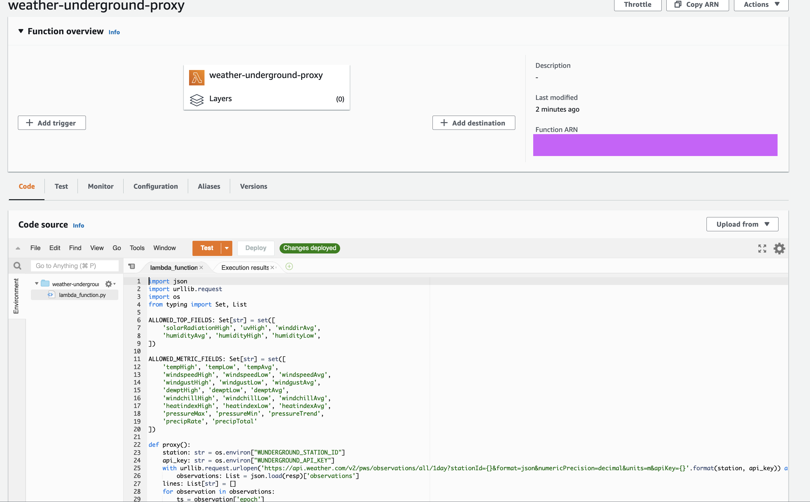
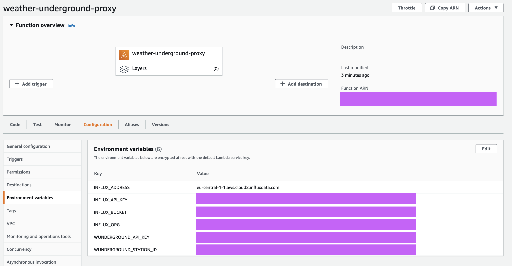
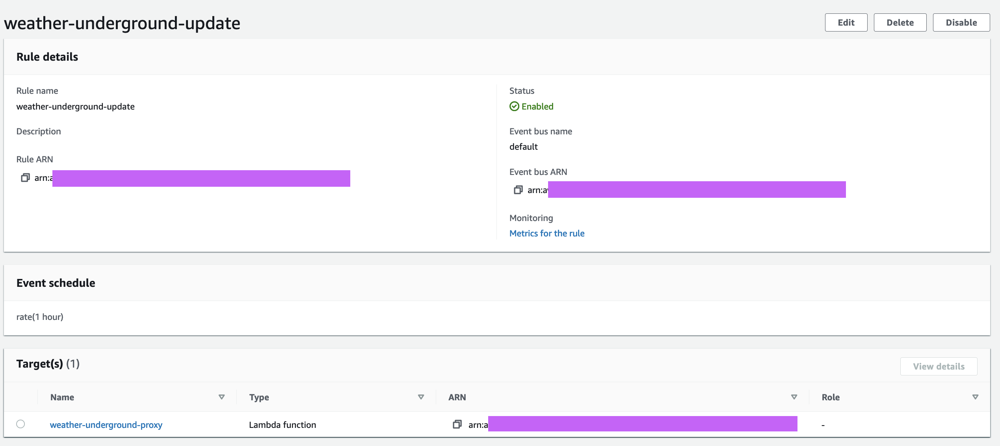

# wunderground-influx-func

Serverless function for replicating Weather Underground data to an influxDB database.

In my case, the data goes:

1. Gathered by Yoshiko YC9471 and sent to base station
2. Forwarded by base station to Weather Underground
3. Downloaded hourly by a Lambda Function in AWS
4. Converted and forwarded to Influx DB Cloud


## Testing locally

Replace values as necessary below:

```
$ WUNDERGROUND_INFLUX_FUNC_test_proxy=1 WUNDERGROUND_STATION_ID=MYSTATION WUNDERGROUND_API_KEY=secret INFLUX_API_KEY=secret INFLUX_ADDRESS=eu-central-1-1.aws.cloud2.influxdata.com INFLUX_ORG=2398573287563438 INFLUX_BUCKET=my_weather make
```

## Deploying AWS

Upload code as a Python 3.8 Lambda function:



Configure the environment variables:



Setup an hourly EventBridge trigger:


